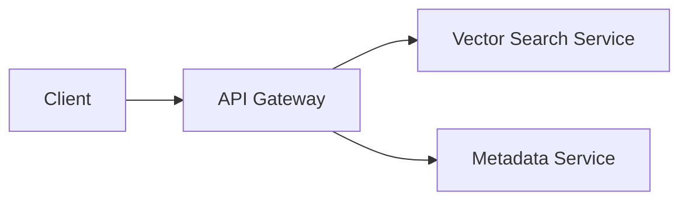
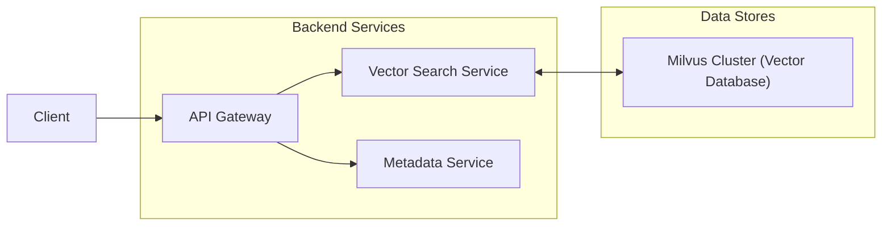
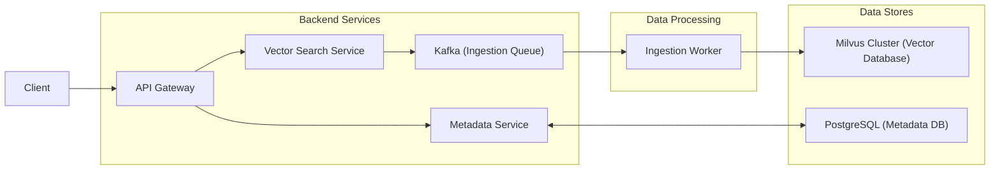
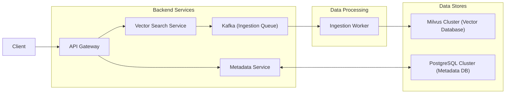
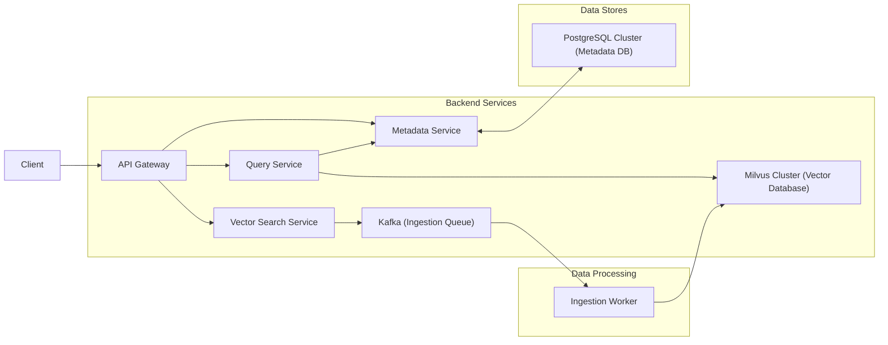
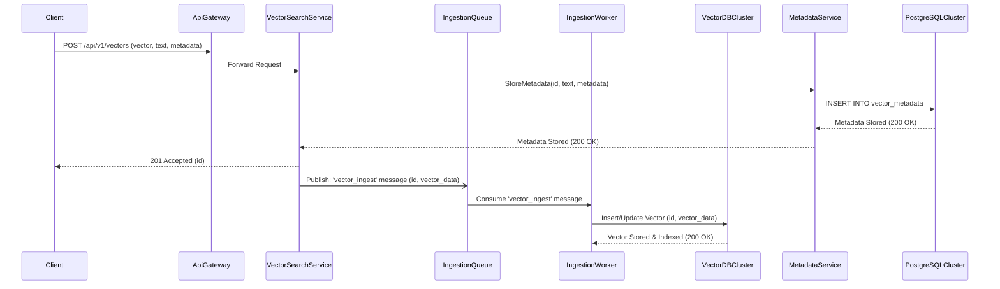
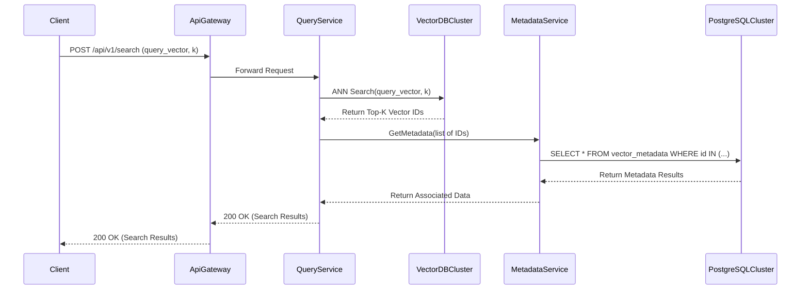
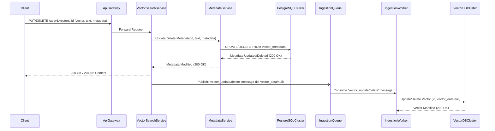

# Vector Database and Semantic Search Engine

> Design a vector database and semantic search engine

## Overview

This system effectively addresses the challenge of building a scalable and performant vector database and semantic search engine for up to 100 million high-dimensional vectors. By employing a microservices architecture with a dedicated Query Service, an asynchronous ingestion pipeline, and specialized data stores (Milvus for vectors, PostgreSQL for metadata), we achieve low-latency ANN searches (<200ms P99) with high recall (>95%) at 500 QPS. The decoupled approach ensures efficient handling of dynamic datasets, allowing frequent insertions and updates without impacting search performance, while maintaining strong consistency for associated textual content and metadata. This design effectively balances performance, scalability, and data integrity for your requirements.

## Requirements

### Functional

- Ingest vectors and their associated metadata and textual content into the database.
- Perform approximate nearest neighbor (ANN) search on vectors using cosine similarity.
- Retrieve associated textual content and metadata alongside vector search results.
- Update existing vectors, their metadata, and textual content efficiently.
- Delete vectors and their associated data from the database.
- Support querying up to 100 million high-dimensional vectors (768-1536 dimensions).

### Non-Functional

| Requirement | Target |
|------------|--------|
| P99 Query Latency | < 200ms for semantic search |
| Peak QPS | 500 QPS for semantic search |
| Recall | >95% at top-10 results |
| Scalability | Support up to 100 million vectors |
| Data Dynamics | Efficient handling of frequent insertions and occasional updates/deletions |
| Associated Data Payload | Retrieve up to 1KB of textual content and metadata per vector |

## Capacity Estimates

| Metric | Value | Breakdown |
|--------|-------|-----------|
| Total Vector Storage | ~600 GB - 1.2 TB | 100 million vectors * 768 dimensions * 4 bytes/dimension (float32) = 307.2 GB.  100 million vectors * 1536 dimensions * 4 bytes/dimension (float32) = 614.4 GB. We'll round this up to account for indexing overhead and potential metadata pointers, leading to an estimated range of 600 GB to 1.2 TB. |
| Associated Text & Metadata Storage | ~100 GB | 100 million vectors * 1 KB/vector = 100 GB. This assumes 1KB is the average size for textual content and metadata combined per vector. |
| Total Storage (Vectors + Data) | ~700 GB - 1.3 TB | Vector Storage (600 GB - 1.2 TB) + Associated Text & Metadata Storage (100 GB) = 700 GB - 1.3 TB |
| Peak Query Read Throughput | ~10 MB/s - 20 MB/s | 500 QPS * (768 dimensions * 4 bytes/dimension for vector + 1KB for associated data) = 500 * (3KB + 1KB) = 500 * 4KB = 2 MB/s (minimum for vector only, if only fetching neighbors). For returning top-k vectors with their associated data: 500 QPS * 10 results * (1536 dimensions * 4 bytes/dimension + 1 KB/item) = 500 * 10 * (6KB + 1KB) = 500 * 10 * 7KB = 35 MB/s. Considering a typical scenario where a portion of the vector data might be returned and the associated text is always returned, let's estimate 500 QPS * (2KB (for vector data) + 1KB (for text) * 10 results) = 500 * (2KB + 10KB) = 500 * 12KB = 6 MB/s for top-10 results. Realistically, fetching the full vector and metadata for top-k could be higher. Assuming we retrieve top-10 results, and each result needs its full 1KB text and metadata, and potentially some vector data (e.g., a few hundred bytes for display/re-ranking), we can estimate a per-query payload of around 20KB. So, 500 QPS * 20KB/query = 10 MB/s. To be safe, with some vector data included in the response, we can estimate up to 20 MB/s. |

## API Endpoints

### POST `/api/v1/vectors`

Ingest a new vector, its associated text, and metadata into the database.  
**Auth:** Bearer token

**Request:**
```json
{ "vector": "array<number>", "text": "string", "metadata": "object" }
```

**Response:**
```json
{ "id": "string", "status": "string" }
```

**Errors:** 400 Invalid input data, 401 Unauthorized, 429 Rate limit exceeded, 500 Internal Server Error

### GET `/api/v1/vectors/:id`

Retrieve a specific vector, its associated text, and metadata by ID.  
**Auth:** Bearer token

**Response:**
```json
{ "id": "string", "vector": "array<number>", "text": "string", "metadata": "object" }
```

**Errors:** 401 Unauthorized, 404 Vector not found, 429 Rate limit exceeded, 500 Internal Server Error

### PUT `/api/v1/vectors/:id`

Update an existing vector, its associated text, or metadata.  
**Auth:** Bearer token

**Request:**
```json
{ "vector?": "array<number>", "text?": "string", "metadata?": "object" }
```

**Response:**
```json
{ "id": "string", "status": "string" }
```

**Errors:** 400 Invalid input data, 401 Unauthorized, 404 Vector not found, 429 Rate limit exceeded, 500 Internal Server Error

### DELETE `/api/v1/vectors/:id`

Delete a vector and all its associated data by ID.  
**Auth:** Bearer token

**Response:**
```json
{ "id": "string", "status": "string" }
```

**Errors:** 401 Unauthorized, 404 Vector not found, 429 Rate limit exceeded, 500 Internal Server Error

### POST `/api/v1/search`

Perform a semantic search for similar vectors based on an input query vector.  
**Auth:** Bearer token

**Request:**
```json
{ "queryVector": "array<number>", "limit?": "number", "offset?": "number", "minScore?": "number" }
```

**Response:**
```json
{ "results": [ { "id": "string", "score": "number", "text": "string", "metadata": "object" } ], "total": "number" }
```

**Errors:** 400 Invalid query vector, 401 Unauthorized, 429 Rate limit exceeded, 500 Internal Server Error

### Rate Limiting
We will implement a distributed token bucket algorithm for rate limiting. For authenticated users, the default limit will be 500 requests per minute per API key/token. The '/api/v1/search' endpoint will have stricter limits due to its resource-intensive nature, set at 300 requests per minute per API key/token. Ingestion and update endpoints will be limited to 100 requests per minute to prevent abuse during bulk operations. Unauthenticated requests will be rejected with a 401 Unauthorized error.

## Data Model

### VectorMetadata (PostgreSQL (or another highly consistent relational database) - vector_metadata table)

| Field | Type | Description |
|-------|------|-------------|
| id | `UUID (PK)` | Unique identifier for the vector and its associated metadata. Used for retrieval, updates, and deletions. |
| associated_text | `TEXT NOT NULL` | The textual content (up to 1KB) associated with the vector. This is the primary human-readable content. |
| metadata | `JSONB` | Additional unstructured metadata associated with the vector (e.g., source, tags, author_id). Stored as JSONB for flexible schema. |
| created_at | `TIMESTAMP DEFAULT NOW()` | Timestamp when the vector and metadata were first ingested. |
| updated_at | `TIMESTAMP DEFAULT NOW()` | Timestamp when the vector or metadata was last updated. |
| deleted_at | `TIMESTAMP` | Timestamp when the vector and metadata were soft-deleted. Null if not deleted. |

**Relationships:** VectorMetadata 1:1 Vector

### Vector (Vector Database (e.g., Milvus, Pinecone, or a custom ANN index layer over object storage like S3))

| Field | Type | Description |
|-------|------|-------------|
| id | `UUID (PK)` | Unique identifier for the vector, corresponding to VectorMetadata.id. |
| vector_data | `FLOAT[] (ARRAY of 768-1536 dimensions)` | The high-dimensional vector data (float32). This is the core data for similarity search. |
| created_at | `TIMESTAMP DEFAULT NOW()` | Timestamp when the vector was first ingested (redundant for consistency with metadata). |
| updated_at | `TIMESTAMP DEFAULT NOW()` | Timestamp when the vector was last updated (redundant for consistency with metadata). |

**Relationships:** Vector 1:1 VectorMetadata

### Indexing & Partitioning
We'll use a two-tiered indexing strategy to meet the requirements of high recall, low latency, and dynamic dataset updates.The primary Approximate Nearest Neighbor (ANN) index will be built on the 'vector_data' field for the 'Vector' entity. Given the scale (100M vectors), high-dimensional nature (768-1536 dims), and dynamic updates, Hierarchical Navigable Small World (HNSW) is a strong candidate for our ANN index. HNSW provides excellent query performance, high recall, and efficient index updates/insertions. It optimizes for the POST /api/v1/search endpoint by allowing rapid approximate similarity searches using cosine similarity.

The 'VectorMetadata' entity will be stored in a PostgreSQL database. A primary key index on 'id' will optimize direct lookups for GET /api/v1/vectors/:id, PUT /api/v1/vectors/:id, and DELETE /api/v1/vectors/:id. An index on 'created_at' (possibly composite with 'deleted_at') could be useful for data retention policies or analytical queries, though not strictly required by the current API.

Partitioning/Sharding Strategy:
For the 'Vector' entity, sharding will be crucial for scaling to 100 million vectors and handling 500 QPS. We will implement sharding based on the 'id' (UUID) of the vector. A consistent hashing scheme or range-based sharding (if UUIDs are sequentially generated or can be mapped to ranges) will distribute vectors across multiple vector database nodes (or HNSW index partitions). This horizontal scaling ensures that no single node becomes a bottleneck, improving both ingestion and query throughput.

For 'VectorMetadata', partitioning by 'id' would mirror the vector sharding strategy, allowing for co-location of vector and metadata lookups. Alternatively, a range or hash-based partitioning on 'id' in PostgreSQL can distribute the load. The choice will depend on the specific PostgreSQL setup and cluster configuration. This strategy optimizes for scenarios where metadata is fetched alongside vector search results, minimizing cross-shard communication for related data.

Denormalization Decisions:
We've chosen to store a lightweight 'created_at' and 'updated_at' field within the 'Vector' entity, even though the canonical source is 'VectorMetadata'. This is a minor denormalization decision made for operational simplicity and potential future optimizations within the vector database itself, should it need to manage its own lifecycle events without constantly querying the metadata store. However, the primary source of truth for these timestamps and 'deleted_at' remains with 'VectorMetadata'. The 'associated_text' and 'metadata' are kept together in 'VectorMetadata' to ensure atomicity and consistency for non-vector data associated with an ID. When performing a semantic search, the vector database will return a list of 'id's, which are then used to fetch the associated 'VectorMetadata' from PostgreSQL.

## Architecture

### Bird's Eye View Architecture

Let's start by outlining the high-level components. We'll introduce an API Gateway to handle incoming requests and provide a unified interface. This gateway will route requests to specialized backend services: a Vector Search Service for all vector-related operations and a Metadata Service for managing the associated textual content and metadata. This separation allows us to scale and optimize each component independently based on its specific workload.

**Technology:** Microservices Architecture (separated components)  
**Rationale:** Given the distinct requirements for high-performance vector indexing/search (low-latency ANN, 500 QPS) and highly consistent, queryable metadata storage (structured data, 1KB text payloads), a microservices approach is essential. It allows us to independently scale and optimize the VectorSearchService and MetadataService, ensuring that bottlenecks in one do not impact the other. This separation of concerns also enables us to leverage specialized data stores best suited for each component's needs: a dedicated vector database for ANN and a relational database for structured metadata.



### Vector Database Cluster

The Vector Database Cluster, specifically Milvus, is essential for storing and indexing our 100 million high-dimensional vectors. The Vector Search Service will interact directly with this cluster to perform ANN searches and manage vector data efficiently, leveraging Milvus's distributed HNSW indexing capabilities.

**Technology:** Milvus Cluster (open-source vector database)  
**Rationale:** Given the dynamic nature of our dataset, the requirement for high recall and low latency ANN search over 100 million vectors, and the need for efficient insertions and updates, Milvus is the most suitable choice. It's an open-source solution that provides a robust, distributed architecture specifically designed for vector search using HNSW. This allows us to scale efficiently and meet performance targets while retaining more control than a fully managed service, balancing operational complexity with cost-effectiveness for a large-scale deployment.



### Asynchronous Ingestion Pipeline

To handle frequent insertions and updates efficiently without impacting real-time search performance, we'll introduce an asynchronous ingestion pipeline. The Vector Search Service will now publish vector ingestion requests to a Kafka queue. This queue is consumed by an Ingestion Worker, which then processes and writes the vector data to the Milvus Vector Database Cluster.

**Technology:** Message Queue (e.g., Kafka, RabbitMQ) + Ingestion Worker  
**Rationale:** Given the requirement for frequent insertions and occasional updates/deletions, and the potential for ingestion spikes, an asynchronous ingestion pipeline using a message queue like Kafka and dedicated ingestion workers is the most robust solution. It decouples the API from the vector processing, preventing ingestion load from impacting search latency and providing reliable, scalable data handling with built-in retry mechanisms.



### Metadata Store

We are adding a PostgreSQL Cluster as our Metadata Store. This cluster will be managed by the Metadata Service and will store all associated textual content and metadata for each vector. This design ensures that the non-vector data is stored with strong consistency and can be efficiently retrieved alongside vector search results.

**Technology:** PostgreSQL Cluster  
**Rationale:** We'll proceed with a PostgreSQL Cluster for our Metadata Store. Given that our associated data includes textual content up to 1KB and general metadata, strong transactional consistency (ACID) and robust support for structured and semi-structured data (via JSONB) are paramount. While MongoDB offers schema flexibility and Cassandra excels in write-heavy scenarios, PostgreSQL provides the best balance of consistency, query capabilities, and proven reliability for our critical metadata, which will be frequently read and occasionally updated alongside vector searches.



### Query Service

To ensure our P99 query latency target of less than 200ms for semantic search, we need a dedicated Query Service. This service will be solely responsible for handling search requests, retrieving vectors from the Milvus Cluster, and fetching associated metadata from the Metadata Service. By separating this concern, we can scale and optimize the search path independently from ingestion and other vector management operations.

**Technology:** Dedicated Query Service  
**Rationale:** A dedicated Query Service is crucial for meeting the strict P99 latency requirement (<200ms) for semantic searches, especially at 500 QPS. Separating it from the Vector Search Service (which also handles ingestion orchestration) allows us to optimize and scale the search path independently, ensuring consistent high performance without interference from other operations.



## Flows

### Vector Ingestion and Indexing Flow

This flow is critical because it demonstrates how new vector data and its associated metadata are asynchronously ingested into the system without blocking the client. It highlights the decoupling of ingestion from real-time search, ensuring that high write loads do not impact query latency. The flow also shows the use of a message queue for reliable, scalable data processing.

1. **Initial Request and Metadata Storage** — The client initiates the ingestion process by sending a vector, its associated text, and metadata to the API Gateway. The Vector Search Service then immediately stores the metadata in PostgreSQL via the Metadata Service to ensure consistency for non-vector data.
2. **Metadata Persistence and Asynchronous Vector Enqueue** — After successfully storing the metadata, the PostgreSQL Cluster confirms the write to the Metadata Service. The Metadata Service then returns confirmation to the Vector Search Service. The Vector Search Service acknowledges the client's request and asynchronously enqueues the vector for processing, ensuring the client isn't blocked by the potentially longer vector indexing process.
3. **Vector Processing and Indexing** — The Ingestion Worker continuously polls the Kafka Ingestion Queue for new vector messages. Upon receiving a message, it retrieves the vector data and sends it to the Milvus Vector Database Cluster for storage and indexing. This asynchronous processing allows for efficient bulk ingestion and ensures the Milvus index remains up-to-date.



### Semantic Search Query Flow

This flow is critical because it demonstrates the system's ability to perform low-latency semantic searches by orchestrating vector lookups and metadata retrieval. It highlights how the Query Service efficiently leverages the Milvus Cluster for ANN search and the PostgreSQL Cluster for associated data, revealing the optimized read path designed for the <200ms P99 latency target.

1. **Search Request and Vector Lookup** — The client sends a search request with a query vector to the API Gateway. The API Gateway forwards this to the Query Service, which then initiates an Approximate Nearest Neighbor (ANN) search in the Milvus Vector Database Cluster.
2. **Vector Search Results** — The Milvus Cluster performs the ANN search and returns a list of top-k nearest vector IDs to the Query Service. This step is optimized for speed, leveraging Milvus's HNSW index.
3. **Metadata Retrieval** — With the vector IDs, the Query Service then requests the associated metadata and textual content for each ID from the Metadata Service. The Metadata Service fetches this data from the PostgreSQL Cluster.
4. **Consolidate and Respond** — The Metadata Service returns the fetched data to the Query Service. The Query Service aggregates all results and constructs the final search response, sending it back to the client via the API Gateway.



### Vector Update/Deletion Flow

This flow is critical because it demonstrates how the system handles modifications and removals of vector data and associated metadata, ensuring consistency across both specialized data stores. It highlights the importance of the Vector Search Service in orchestrating updates to both Milvus and PostgreSQL, maintaining data integrity while allowing for efficient dynamic dataset management.

1. **Update/Delete Request and Metadata Modification** — The client initiates an update or delete operation by sending a request to the API Gateway. The Vector Search Service processes this and first modifies the metadata in PostgreSQL via the Metadata Service to ensure consistency for non-vector data before attempting to modify the vector itself.
2. **Metadata Persistence and Asynchronous Vector Enqueue** — After the PostgreSQL Cluster successfully updates or deletes the metadata, the Metadata Service confirms this to the Vector Search Service. The Vector Search Service then acknowledges the client and asynchronously enqueues a message for vector modification, ensuring the client isn't blocked by the potentially longer vector indexing/deletion process.
3. **Vector Processing and Index Modification** — The Ingestion Worker consumes the modification message from the Kafka Ingestion Queue. Based on the message, it either updates the existing vector data or deletes it from the Milvus Vector Database Cluster, thus keeping the vector index synchronized with the metadata.


